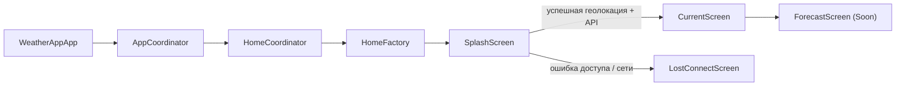

# WeatherApp
`WeatherApp` — это учебное iOS-приложение на `SwiftUI`, которое определяет текущую геопозицию пользователя и показывает актуальную погоду через [WeatherAPI](https://www.weatherapi.com/).
Проект построен без сторонних библиотек и демонстрирует работу с `SwiftUI`, `CoreLocation`, `URLSession`, простой навигацией через coordinator-подход и базовым файловым кэшем.
## Что умеет приложение
- Показывает splash-экран при запуске.
- Запрашивает доступ к геолокации пользователя.
- Получает текущую погоду по координатам.
- Отображает город, температуру, описание погоды, локальное время, скорость и направление ветра, атмосферное давление.
- Загружает иконку погодного состояния из API.
- Формирует приветствие в зависимости от локального времени в выбранной локации.
- Переводит пользователя на экран ошибки, если геолокация недоступна или сетевой запрос завершился неуспешно.
- Содержит заготовку экрана прогноза на несколько дней.
## Экраны
- `SplashScreen` — стартовый экран с индикатором загрузки.
- `CurrentScreen` — основной экран с текущей погодой.
- `ForecastScreen` — экран-заглушка с кнопкой возврата назад.
- `LostConnectScreen` — экран ошибки, который показывается при проблемах с доступом к данным.
## Стек
- `Swift 5`
- `SwiftUI`
- `CoreLocation`
- `URLSession`
- `NavigationStack`
- файловый кэш через `FileManager`
- собственные шрифты `ChironGoRoundTC`
## Архитектура
В проекте используется комбинация `Coordinator + Factory + DI + ViewModel`.

### Основные роли
- `AppCoordinator` и `HomeCoordinator` управляют корневой навигацией.
- `Router` инкапсулирует переходы вперёд и назад через `NavigationPath`.
- `HomeFactory` создаёт экраны и связывает их с view model.
- `Home.DiContainer` собирает сервисы приложения.
- `SplashViewModel` получает геопозицию, делает запрос к API и подготавливает данные для главного экрана.
- `CurrentViewModel` отдаёт готовые данные во view и обрабатывает переход на экран прогноза.
## Структура проекта
```text
WeatherApp/
├── WeatherApp/
│   ├── App/
│   │   ├── EntryPoint/
│   │   ├── Constants/
│   │   ├── Services/
│   │   ├── Design/
│   │   └── Assets/
│   ├── AppCoordinator/
│   └── Flows/
│       └── Home/
│           ├── Screens/
│           │   ├── Splash/
│           │   ├── Current/
│           │   ├── Forecast/
│           │   └── LostConnect/
│           ├── HomeFactory.swift
│           └── HomeDiContainer.swift
└── WeatherApp.xcodeproj
```
## Сетевой слой
Приложение использует `WeatherAPI` и сейчас работает с двумя типами запросов:
- текущая погода: `/v1/current.json`
- иконка погодного состояния: URL из ответа API
Настройки хоста и путей находятся в `WeatherApp/App/Constants/Constants.swift`.
## Кэш
В проекте есть `CacheManager`, который сохраняет:
- JSON-ответ с текущей погодой
- изображение погодной иконки
Кэш записывается в `Caches/WeatherCache`. На текущем этапе данные сохраняются после успешного ответа, но восстановление интерфейса из кэша при оффлайн-запуске ещё не подключено.
## Требования
- `Xcode 16.4+`
- `iOS 18.5+`
- ключ от [WeatherAPI](https://www.weatherapi.com/)
## Как запустить
1. Откройте `WeatherApp.xcodeproj` в Xcode.
2. Получите API-ключ на [WeatherAPI](https://www.weatherapi.com/).
3. Укажите ключ в файле `WeatherApp/App/Constants/Constants.swift` вместо:
```swift
static let apiKey = "?"
```
4. Выберите схему `WeatherApp`.
5. Запустите приложение на устройстве или симуляторе.
6. Разрешите доступ к геолокации при первом запуске.
## Permissions
Приложение использует разрешение:
- `NSLocationWhenInUseUsageDescription` — доступ к геопозиции для получения текущей погоды пользователя
## Что важно знать о текущем состоянии проекта
- Экран прогноза на несколько дней пока не реализован и содержит заглушку `Soon`.
- В проекте нет unit-тестов и UI-тестов.
- API-ключ пока хранится прямо в коде в `Constants.swift`.
- При ошибке сети или отказе в геолокации пользователь попадает на экран `LostConnectScreen`.
## Возможные улучшения
- вынести API-ключ в `xcconfig` или другой безопасный конфиг
- подключить полноценный оффлайн-фолбэк из кэша
- реализовать экран прогноза на 3-7 дней
- добавить `unit/UI tests`
- доработать обработку сетевых ошибок и состояний загрузки
